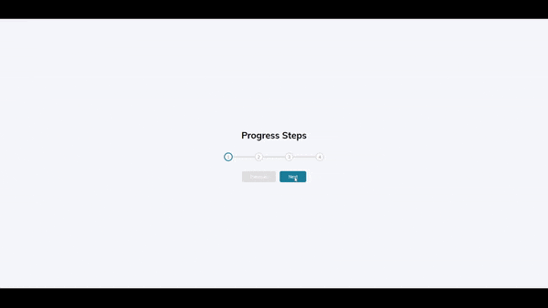

# Progress Steps

## 🚀 Overview

This project demonstrates the "Progress Steps" functionality, where users can navigate through a multi-step process with a visual indicator showing their current progress. It's ideal for forms or any step-based workflows.

### 🎯 Project Goals:
- Create a multi-step progress bar to visually indicate the user's progress.
- Implement navigation buttons ("Previous" and "Next") to move between steps.
- Use JavaScript to update the progress bar and step indicators dynamically as users navigate through the steps.
- Apply CSS transitions to ensure smooth updates to the progress bar.

## 🛠️ Built With

- [HTML5](https://www.w3schools.com/html/)
- [CSS3](https://www.w3schools.com/css/)
- [JavaScript](https://www.w3schools.com/js/)
